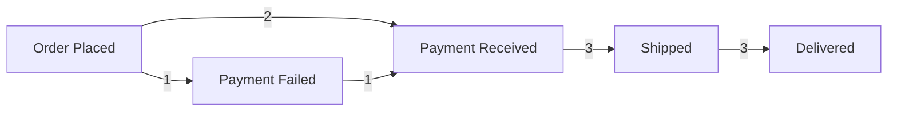

# Expected Results — `sample_event_log.csv`

This is the ground truth for the happy-path fixture. Every number below was computed by hand, not generated by the engine — use it to check Opus's implementation, not the other way around.

The log has **3 cases**, **13 events**, **5 distinct activities**, and **2 process variants** (one "clean" path, one with a payment retry). This shape is deliberate: it's the smallest log that exercises every FR at once.

---

## 1. Directly-Follows Graph (FR-4/FR-5)

**Nodes** (activity → total occurrence count across the log):

| Activity | Frequency |
|---|---|
| Order Placed | 3 |
| Payment Received | 3 |
| Payment Failed | 1 |
| Shipped | 3 |
| Delivered | 3 |

**Edges** (A → B, weighted by how many times B immediately followed A, across all cases):

| From | To | Frequency |
|---|---|---|
| Order Placed | Payment Received | 2 |
| Order Placed | Payment Failed | 1 |
| Payment Failed | Payment Received | 1 |
| Payment Received | Shipped | 3 |
| Shipped | Delivered | 3 |

**Start activities:** `Order Placed` (3 — every case starts here)
**End activities:** `Delivered` (3 — every case ends here)

---

## 2. Variants (FR-6)

Ranked by frequency, most common first:

| Rank | Sequence | Case count | Cases | Percentage |
|---|---|---|---|---|
| 1 | Order Placed → Payment Received → Shipped → Delivered | 2 | case-001, case-003 | 66.7% |
| 2 | Order Placed → Payment Failed → Payment Received → Shipped → Delivered | 1 | case-002 | 33.3% |

---

## 3. Statistics (FR-7)

| Metric | Value |
|---|---|
| Case count | 3 |
| Event count | 13 |
| Case durations | case-001: 49h · case-002: 71h · case-003: 55h |
| **Average case duration** | **58h 20m** (175h / 3) |
| **Median case duration** | **55h** (case-003) |
| Top start activity | Order Placed (3) |
| Top end activity | Delivered (3) |

**Duration math, shown so it's checkable:**
- case-001: 2026-01-01 09:00 → 2026-01-03 10:00 = **49h**
- case-002: 2026-01-01 10:00 → 2026-01-04 09:00 = **71h**
- case-003: 2026-01-02 08:00 → 2026-01-04 15:00 = **55h**

---

## 4. Bottlenecks (FR-8)

Ranked by average time-to-next-activity, descending (this is "where does time actually get lost"):

| Rank | Activity | Avg. time to next activity | Observations |
|---|---|---|---|
| 1 | Payment Received | **34h 30m** | 3 |
| 2 | Shipped | 23h 40m | 3 |
| 3 | Payment Failed | 13 min | 1 |
| 4 | Order Placed | 5 min 40s | 3 |

`Delivered` has no outgoing edge (it's an end activity), so it's excluded from bottleneck ranking — worth checking the implementation doesn't error or fabricate a value here.

**Per-case detail behind rank #1 (Payment Received → Shipped gap — the real "shipping prep" delay):**
- case-001: 09:05 Jan 1 → 14:00 Jan 2 = 28h 55m
- case-002: 10:15 Jan 1 → 09:00 Jan 3 = 46h 45m
- case-003: 08:10 Jan 2 → 12:00 Jan 3 = 27h 50m
- Average = (28h55m + 46h45m + 27h50m) / 3 = **34h 30m**

---

## 5. Mermaid export sanity check (§5 `format=mermaid`)

The mined graph should render as something equivalent to:

If pasting the API's `format=mermaid` output into a GitHub markdown preview doesn't produce this shape, that's a bug worth catching before it ships — it's the one feature explicitly meant to be checked by eye.

---

# Expected Results — `malformed_event_log.csv`

This is the FR-2 error-path fixture. It has **one valid event and four deliberately broken rows**, each testing a distinct validation rule. Expected behavior: **no silent failures, no generic 500s** — each bad row should surface as a distinct, actionable `422 problem+json` error (or the ingestion should reject the whole batch with a list of per-row problems — either is acceptable, but it must be specific per row, not one vague message).

| Row | Content | What's wrong | Expected error |
|---|---|---|---|
| 2 | `case-101, Payment Received, 2026-01-13-01T09:05:00Z` | Malformed timestamp (`2026-01-13-01` is not a valid date — month 13 doesn't exist, extra segment) | 422, unparseable-timestamp, row 2 |
| 3 | `case-102, Order Placed, ` (empty timestamp) | Missing timestamp | 422, missing-timestamp, row 3 |
| 4 | `case-102, Shipped, 2026-01-01T11:00:00Z` | Valid on its own, but **out of case order** — this case's only other row (row 3) is missing a timestamp, so case-102 can't be fully ordered | Depends on implementation: either flagged as a dependent failure of row 3, or processed once row 3 is fixed — worth asking Opus which behavior was chosen and confirming it's documented |
| 5 | ` , Payment Received, 2026-01-01T09:10:00Z` (empty case_id) | Missing case ID | 422, missing-case-id, row 5 |

**What "good" looks like here:** run this file through ingestion and confirm you get back 3–4 distinct, row-numbered problem entries — not a stack trace, not a single "invalid file" message, and not a silently-dropped row that lets the rest of the file process without telling you anything was skipped.

---

*Use `sample_event_log.csv` to verify the mining engine is mathematically correct. Use `malformed_event_log.csv` to verify the ingestion layer fails loudly and specifically, per NFR-3.*
